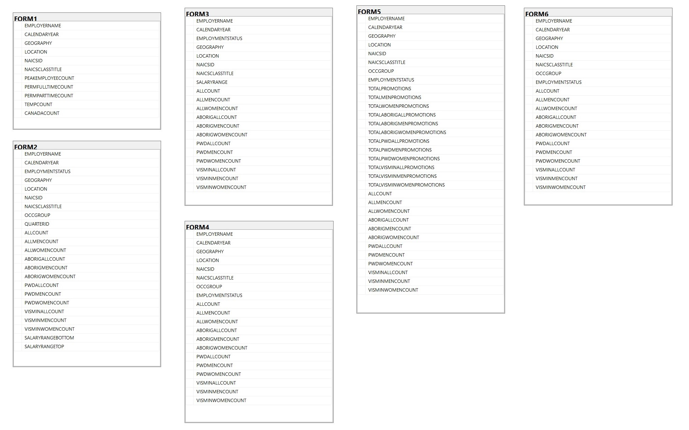
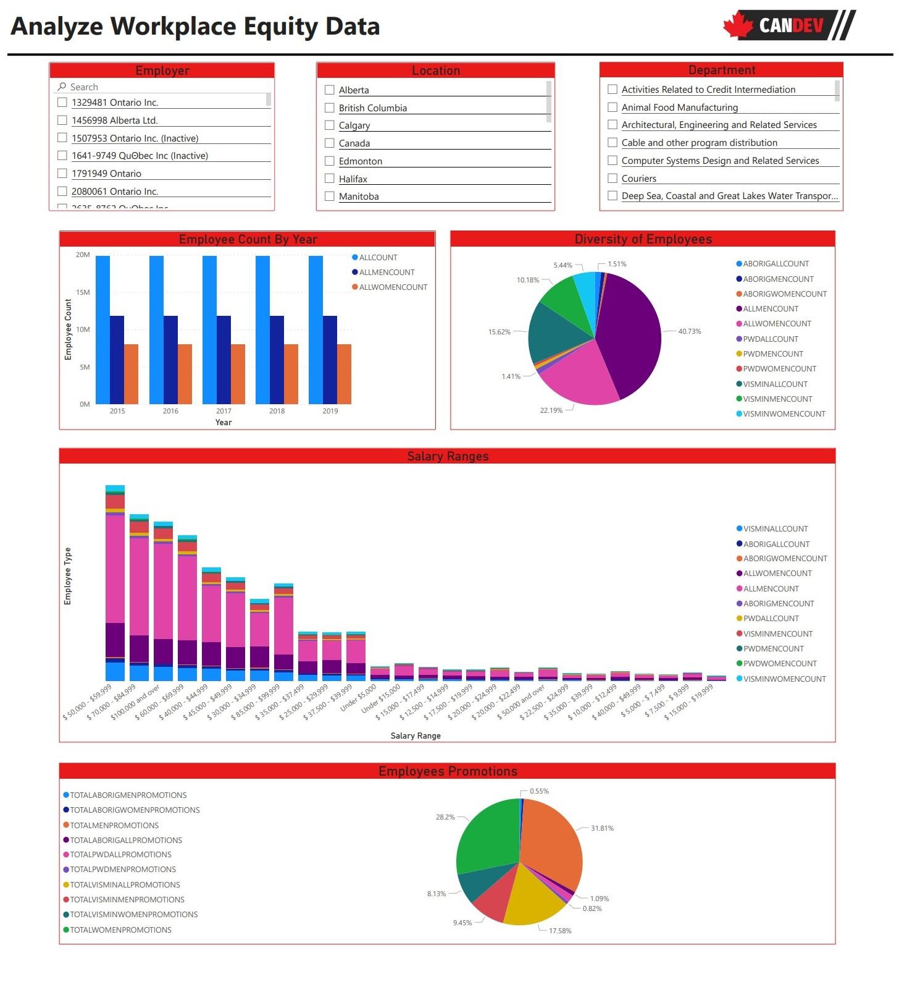

# Candev Challenge 2022

During the challenge we were provided with exel spreadsheets containing all the diversity data recorded by companies over the years. We started off by inserted relevant data into our SQL database using Microsoft SQL Server Management Studio. The data and different tables used on our Power BI report is seen in the image below.

We were able to export our database into Power BI and create the an Employer, Location, and Department filter. Our dashboard seen below allows users to vizuialze data based on their preferences. 

